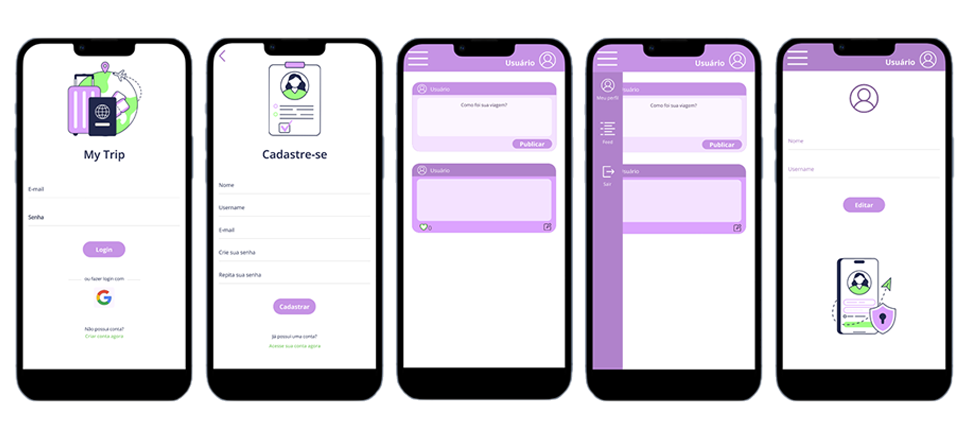

## Índice

* [Descrição do Projeto](#descrição-do-projeto)
* [Planejamento](#método-scrum)
* [Histórias de Usuário](#histórias-de-usuário)
* [Testes de Usabilidade](#testes-de-usabilidade)
* [Protótipos](#protótipos)
* [Implementações Futuras](#implementações-futuras)
* [Desenvolvedoras](#desenvolvedoras)

## Descrição do Projeto
O My Trip é um projeto desenvolvido como parte do bootcamp da Laboratoria. Trata-se de uma rede social dedicada a viajantes, cujo objetivo é reunir pessoas que desejam compartilhar dicas e experiências de viagens. No aplicativo, os usuários podem criar postagens no feed, onde também é possível curtir, editar e excluir suas publicações.

<h1 align='center'>My Trip</h1>

  

[Acesse o projeto aqui](https://mytrip-1b924.web.app/)

## Planejamento 
Para gerenciar o desenvolvimento do projeto, utilizamos o Método Scrum. Você pode acompanhar nosso progresso e atividades no Trello.
[Link do Trello](https://trello.com/invite/b/GNknWcZf/ATTI7a1d50e0a1b0f2991ddcfe191a42ea4c30D503C0/310-social-network)

## Histórias de Usuário
`História de Usuário 1`: "Desejo poder editar e excluir minhas publicações." 
`História de Usuário 2`: "Gostaria de poder entrar na rede diretamente com a minha conta do google, assim seria mais prático para mim." 
`História de Usuário 3`: "Como uma pessoa com pouca experiência de viagens, gostaria de encontrar dicas relevantes para os meus próximos destinos." 

## Testes de Usabilidade
Realizamos testes de usabilidade com os usuários para aprimorar a experiência no aplicativo. Os usuários preencheram um formulário com feedback sobre sua experiência no app e também forneceram sugestões. Você pode acessar o [formulário aqui](https://forms.gle/Js8uiRF7yxKxA6Tt9)

## Protótipos

[Link Protótipo de Alta Fidelidade](https://www.figma.com/proto/K44pKXuVtuTWPo1Vzr4Lix/My-Trip---Prot%C3%B3tipo-de-Alta?page-id=106%3A52&type=design&node-id=127-130&viewport=-139%2C315%2C0.5&t=KJQiy664EHSlTkHH-1&scaling=scale-down&starting-point-node-id=120%3A1746&mode=design)

[Link Protótipo de Baixa Fidelidade](https://www.canva.com/design/DAFuKjgcZvE/5Kg4SqoEx_7paNjye1Tzng/edit?utm_content=DAFuKjgcZvE&utm_campaign=designshare&utm_medium=link2&utm_source=sharebutton)

## Implementações Futuras

Estamos planejando adicionar várias funcionalidades ao My Trip para melhorar a experiência do usuário:

- Botão menu hambúrguer
- Botão Like
- Adicionar imagem e localização no post
- Página do usuário, parar editar o Nickname
- Interface para desktop

Continuaremos aprimorando-o com base no feedback dos usuários. Obrigado por acompanhar nosso projeto!

## Desenvolvedoras

- [@thamiresfebbo](https://github.com/thamiresfebbo)
- [@ariadnesantos](https://github.com/ariadnesantos)

